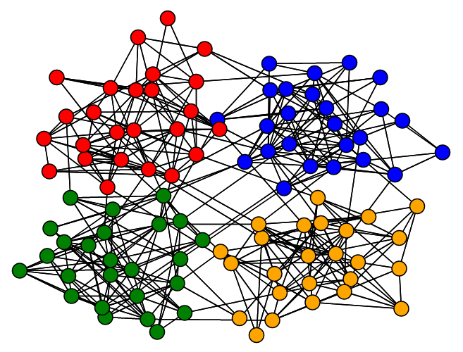



Research Interests
=====

My research interests with regards to the clustering, hypothesis testing, and random models that can be applied to network data. I am also broadly interested in statistics education and statistics philosophy.

Below are brief summaries of my past and current research projects.

Brain Connectivity Networks
=====

This research utilized graph theory measures of similarity to compare the functional connectivity networks of the same subject over different imaging sessions. 

Network Clustering
=====

This research primarily focused on studying modern network clustering algorithms and analyzing their performance on real-world data with a known "ground-truth" clustering, and on synthetic data generated via the stochastic block model.
