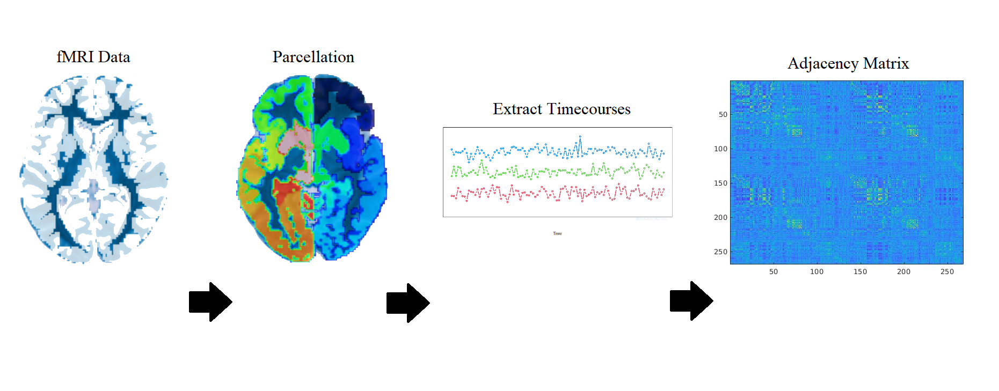



Research Interests
=====

My research interests with regards to high dimensional and network statistics. I am also broadly interested in statistics education and statistics philosophy.

Current Research: Connectome Fingerprinting
=====

The problem of connectome fingerprinting is centered around the process of identifying an individual solely based on a network representation of their functional magnetic resonance imaging (fMRI), a noninvasive neuroimaging method that indirectly measures brain activity in-vivo. This is typically done by collecting fMRI data for a group of subjects across two imaging sessions, then calculating the distance between each network in the first session to all networks in the second session, then predicting two networks to be from the same subject if they have the minimum distance between one another. In this research, we integrate measures of distance found in traditional graph theory, such as edit and spectral distance. You can find a copy of the poster presentation a gave on this research [here](https://oscarfawcett.github.io/_pages/poster.PNG). 

